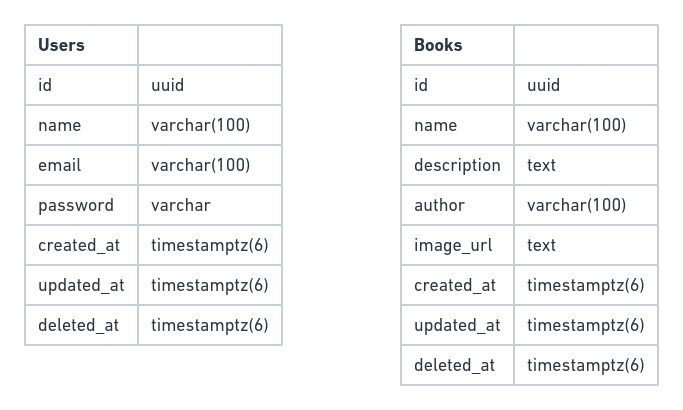

# BOOK API - 

Na tentativa de estudar a famosa e grandiosa linguagem denominada GO (Golang); 


---

## Run project

* Antes de tudo é necessario configurar as variaveis de ambiente que estão no arquivo *run.sh* na raiz do projeto

```sh
export APP_PORT=3000
export JWT_SECRET=BOOK_API
export DB_HOST=
export DB_PORT=
export DB_NAME=
export DB_USER=
export DB_PASS=
```

* Agora basta executa o comando <h6>(obs: lembrando de está com o make instalado na maquina)</h6>
```sh
make run
```

---

## Main libraries used

* GIN

  Gin is a web framework written in Go (Golang). It features a martini-like API with performance that is up to 40 times faster thanks to httprouter. If you need performance and good productivity, you will love Gin.
  
* GORM

  The fantastic ORM library for Golang, aims to be developer friendly.

---

## Database schema

